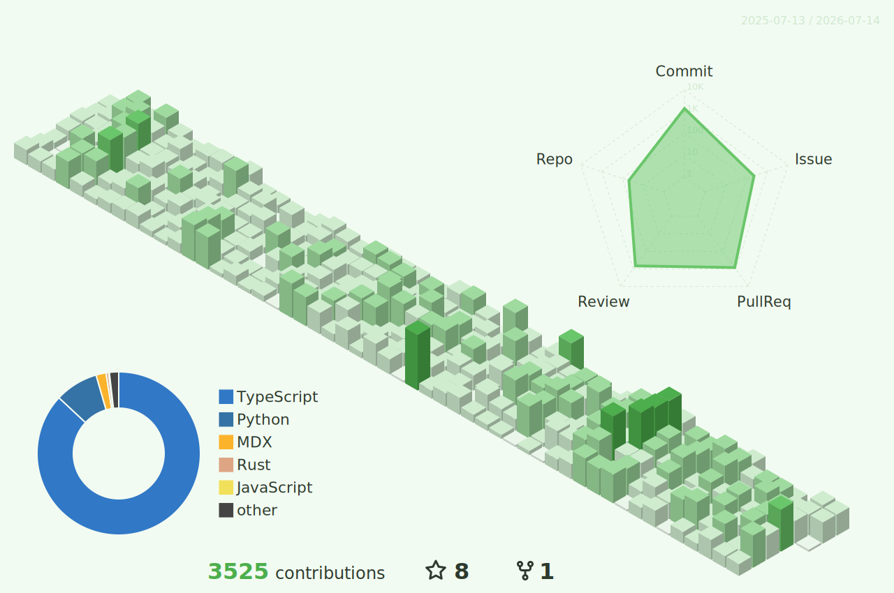

## 👋 Hi, I'm yyh

I'm a **product-oriented full-stack engineer** focused on building **scalable web systems and developer-friendly architectures**.

I care about more than just shipping features —  
I design systems that improve **developer experience, consistency, and long-term maintainability**.

### What I focus on

- ⚛️ **Frontend Architecture**
  - React / TypeScript
  - Component systems, state management, UI semantics

- 🧩 **Engineering Systems**
  - Monorepos, CI/CD, testing, code quality
  - Scalable team workflows and infrastructure

- 🔗 **Full-stack & BFF**
  - Node.js, API design
  - Bridging product logic and frontend systems

- 🤖 **AI-driven Products**
  - LLM applications and developer tooling
  - Turning AI into real, usable workflows

---

I enjoy building systems that are **clear, consistent, and easy to evolve**.

  <picture>
    <source media="(prefers-color-scheme: dark)" srcset="./profile-3d.svg">
    <source media="(prefers-color-scheme: light)" srcset="./profile-3d.svg">
    
  </picture>

