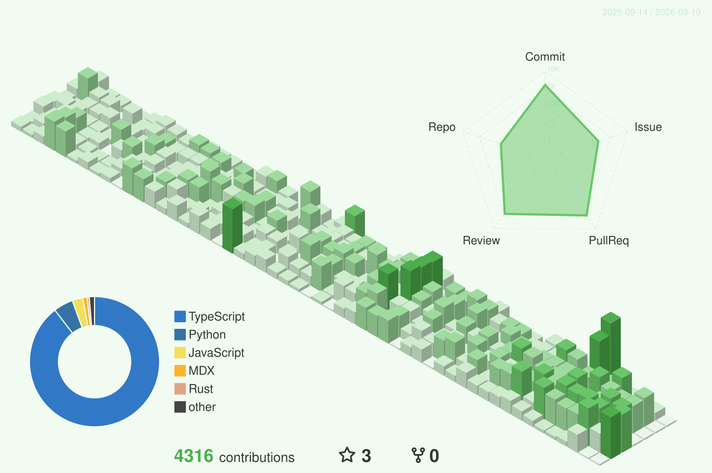

## 👋 Hi, I'm yyh

I'm a frontend engineer focused on **product infrastructure** — the shared systems that make complex web products easier to build and evolve.

I work mainly with **React and TypeScript**, across component architecture, accessible UI, state management, testing, CI, and developer tooling. I also build AI-powered workflows where product behavior and engineering systems meet.

I care about **clear ownership, observable behavior, and maintainable systems** — not abstractions that only look good on paper.

  

