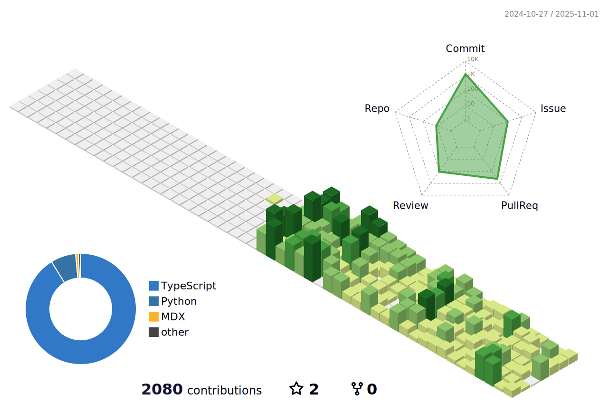

## 👋 Hi there, I'm lyzno1

I'm currently exploring cutting-edge AI applications, focusing on **LLM Agents**.
Actively contributing to open-source projects like [Dify](https://github.com/langgenius/dify) and building tools to test, visualize, and monitor AI workflows.

  

  
  

